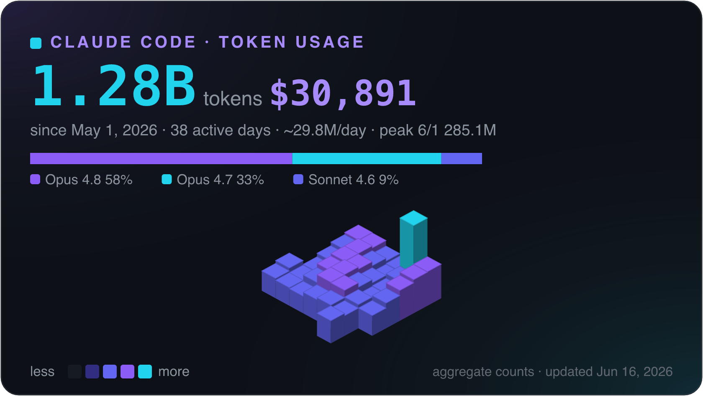
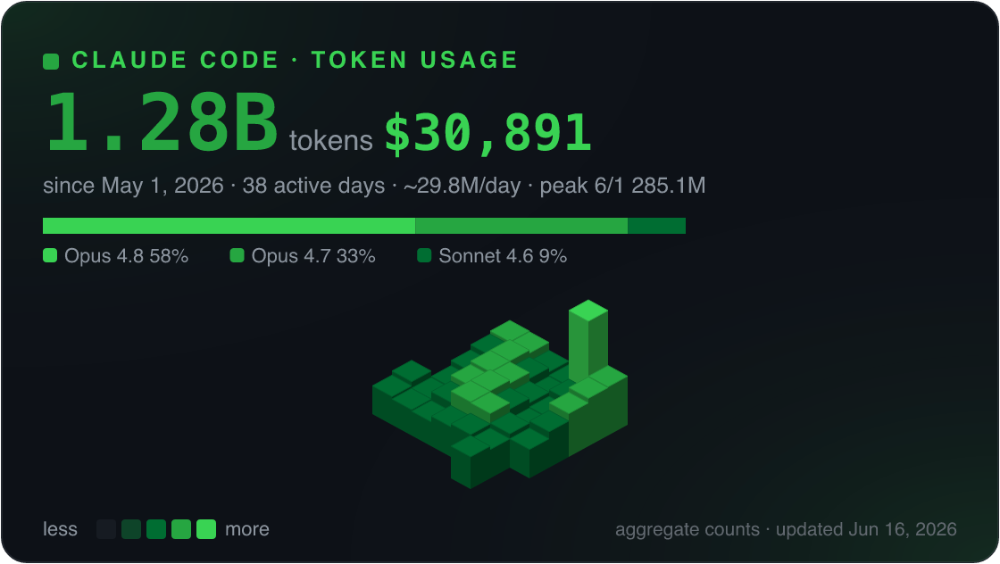
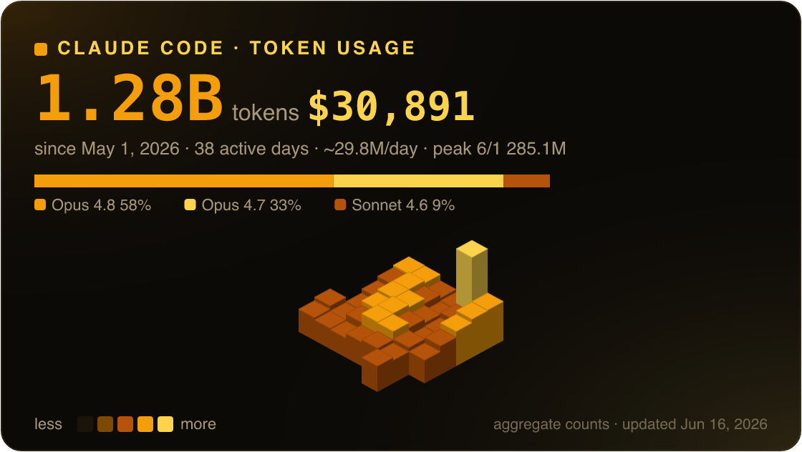
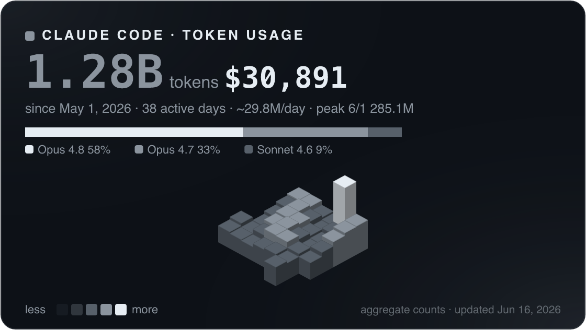

<div align="center">

# 🧊 claude-usage-graph

### Turn your Claude Code token usage into a beautiful 3D isometric calendar.

A GitHub-contribution-style card — built from your **local** Claude Code session
transcripts, rendered as a self-contained SVG (and optional PNG). Aggregate counts
only, so it's safe to put on your profile.

<br />

[](https://github.com/convenientlymike/claude-usage-graph/actions/workflows/ci.yml)
&nbsp;
[](https://www.npmjs.com/package/claude-usage-graph)
&nbsp;
[](LICENSE)
&nbsp;

&nbsp;

&nbsp;

&nbsp;
[](https://convenientlymike.github.io/claude-usage-graph/)

<br />



</div>

## ▶️ Try it

- **[Live playground →](https://convenientlymike.github.io/claude-usage-graph/)** — paste your usage JSON (or use the built-in sample), switch themes, download the card. Runs entirely in your browser.
- **One-liner** (no install — runs from GitHub via `npx`):
  ```bash
  npx github:convenientlymike/claude-usage-graph --png
  # → claude-usage.svg + claude-usage.png, built from ~/.claude/projects
  ```

## Why

[`ccusage`](https://github.com/ryoppippi/ccusage) and `/usage` tell you the *numbers*.
This turns those numbers into something you'd actually **show** — a calendar where each
day is a little cube whose height and color scale with how hard you ran Claude Code that
day. Drop it on your GitHub profile next to your contribution graph, in a README, or a
dashboard. It reads the same local transcripts, emits **only aggregate daily counts**
(never project names, paths, or message content), and produces a self-contained SVG that
renders identically everywhere.

## ✨ Features

- **🧊 3D isometric calendar** — one cube per day; **height + color** scale with that
  day's token volume (√-scaled so a 50× peak doesn't flatten the quiet days). Plus a hero
  stat — **total · active days · daily average · peak day** — and a per-model split bar.
- **💵 Dollar value** — converts your tokens to USD at Anthropic's list API prices (per
  model: Opus / Sonnet / Haiku, verified 2026-06). **Cache tokens are priced as output
  tokens** — input at the input rate, everything else (output + cache) at the output rate.
  The card shows a clean figure; `--cost off` hides it. (List price for scale, not a
  subscription bill — that caveat lives in the docs, not on the image.)
- **🔒 Aggregate counts only** — reads token counts, timestamps, and the model id; never
  project names, file paths, prompts, or content. `--emit-json` writes *exactly* what gets
  rendered so you can audit what you share. **Safe for a public profile by construction.**
- **🪶 Zero *required* runtime dependencies** — the aggregate + SVG core is pure
  TypeScript. PNG is an *optional* extra (`@resvg/resvg-js`), loaded only for `--png`.
- **🖼 Native SVG, renders everywhere** — plain SVG primitives (no `<foreignObject>`), so
  it looks identical on GitHub, iOS Safari, and any rasterizer. `--png` for a crisp,
  transparent, Retina-scaled raster.
- **🎨 Four themes** — `brand` (violet→cyan), `github` (greens), `amber`, `mono`.
- **🧰 CLI + library** — script it (`renderSVG(aggregateDir())`) or run it; cross-platform
  (macOS · Linux · Windows), Node ≥ 22.

## 📸 Themes

<table>
<tr>
<td width="50%"><br /><sub><b>brand</b> — violet→cyan (default)</sub></td>
<td width="50%"><br /><sub><b>github</b> — the classic contribution greens</sub></td>
</tr>
<tr>
<td width="50%"><br /><sub><b>amber</b> — warm, high-contrast</sub></td>
<td width="50%"><br /><sub><b>mono</b> — grayscale, minimal</sub></td>
</tr>
</table>

## 🚀 Quickstart

```bash
# Run it without installing (from GitHub):
npx github:convenientlymike/claude-usage-graph --png --stats

# Or install globally:
npm i -g claude-usage-graph         # then: claude-usage-graph --png
claude-usage-graph --theme github -o card.svg --png
```

By default it reads `~/.claude/projects` (where Claude Code stores session transcripts)
and writes `claude-usage.svg` to the current directory.

| Need | Command |
|---|---|
| SVG card (default) | `claude-usage-graph` |
| SVG + PNG, github theme | `claude-usage-graph --theme github -o card.svg --png` |
| Print a usage summary | `claude-usage-graph --stats` |
| Just the data (counts only) | `claude-usage-graph --emit-json usage.json` |
| Render from a saved JSON | `claude-usage-graph --json usage.json -o card.svg` |
| A different transcripts dir | `claude-usage-graph --dir /path/to/projects` |

### CLI options

```
-o, --out <file>     output path (default: claude-usage.svg; .png implies --png)
    --png            also write a PNG (needs the optional @resvg/resvg-js)
-s, --scale <n>      PNG device scale (default 3 — crisp on Retina)
    --theme <name>   brand (default) · github · amber · mono
    --cost <mode>    USD figure (list price): io (input+output, default) · all-in · off
    --title <text>   header title
    --dir <path>     transcripts dir (default ~/.claude/projects)
    --json <file>    render from an emitted/compatible JSON instead of transcripts
    --emit-json <f>  write the aggregate JSON (counts only)
    --stats          print a usage summary
-h, --help    ·   -v, --version
```

## 🔒 Privacy

The whole point is that this is **safe to publish**. The parser reads only:

- token **counts** (`input` / `output` / `cache_creation` / `cache_read`),
- the message **timestamp**, and
- the **model id**.

It never reads — and the output never contains — project names, file paths, prompts, or
any message content. Want to be sure? `--emit-json usage.json` writes the *exact*
`{ byDay, byModel }` count map that gets rendered; inspect it, then `--json usage.json` to
render from it on any machine. No network calls, no telemetry.

> Heads up: like `ccusage`, the total is dominated by **cache-read** tokens — that's normal
> for Claude Code (every turn re-reads cached context). The `--stats` view breaks it down.

## 💵 What the dollar figure means

The USD is computed at **Anthropic's list API prices**, per model (e.g. Opus 4.5+ at
`$5 / $25` per Mtok input/output, Sonnet at `$3 / $15`, Haiku 4.5 at `$1 / $5`; verified
2026-06 from the [pricing page](https://platform.claude.com/docs/en/about-claude/pricing)).

- **Cache is priced as output.** `cost = input × inputRate + (output + cacheCreate +
  cacheRead) × outputRate`. Anthropic's cheaper cache rates are deliberately *not* applied,
  so it's a simple, on-the-high-side figure rather than a precise metered cost.
- It is **not your bill.** If you're on a Claude Pro/Max *subscription*, you pay a flat
  fee — this is the equivalent list-price value, shown for scale. `--cost off` hides it.
- The **card shows only the dollar number** — this basis note is kept here in the docs,
  off the image, on purpose.

`--stats` prints it. Rates live in [`src/pricing.ts`](src/pricing.ts).

## 🏗 How it works

```
~/.claude/projects/**/*.jsonl          aggregate (counts only)        render
┌─────────────────────────┐      ┌───────────────────────────┐   ┌──────────────┐
│ assistant turns carry    │      │ byDay:  {date -> quad}     │   │ isometric    │
│ message.usage + timestamp│ ───▶ │ byModel:{model -> quad}    │──▶│ SVG card     │──▶ .svg
│ + model                  │      │ totals, range, peak        │   │ (+ optional  │──▶ .png
└─────────────────────────┘      └───────────────────────────┘   │  resvg PNG)  │
   parse, sum — no content                                        └──────────────┘
```

- [`src/aggregate.ts`](src/aggregate.ts) — walk transcripts → per-day / per-model token quads (or load a JSON).
- [`src/render.ts`](src/render.ts) — isometric geometry + theming → a self-contained SVG string.
- [`src/png.ts`](src/png.ts) — lazy `@resvg/resvg-js` rasterization (optional).
- [`src/cli.ts`](src/cli.ts) — the command-line surface.

### Library

```ts
import { aggregateDir, renderSVG, renderPNG } from "claude-usage-graph";

const agg = aggregateDir();               // parse ~/.claude/projects
const svg = renderSVG(agg, { theme: "brand", title: "MY CLAUDE YEAR" });
const png = await renderPNG(svg, 3);      // Uint8Array (optional dep)
```

## 📌 Put it on your GitHub profile

1. Generate the PNG: `claude-usage-graph --png -o assets/claude-usage.png`
2. Commit it and embed it in your profile `README.md`:
   ```md
   
   ```
3. To keep it fresh, regenerate on a schedule (cron / launchd / a Git hook) and commit.
   *(macOS tip: scheduled jobs can't read `~/Desktop`/`~/Documents` due to privacy — keep
   the repo clone somewhere like `~/.cache` for the automation.)*

## Project layout

```
src/
  aggregate.ts   parse transcripts / JSON → token quads
  render.ts      3D isometric SVG + themes
  png.ts         optional resvg-js rasterization
  cli.ts         command-line interface
  index.ts       library exports
test/            node --test (+ a JSONL fixture)
docs/            GitHub Pages playground + screenshots
examples/        a sample aggregate (used by the README + playground)
```

## Supported OS

macOS · Linux · Windows (CI runs the full matrix). Node ≥ 22.

## Security

See [SECURITY.md](SECURITY.md). TL;DR: local-only, no network, aggregate counts only.

## License

[MIT](LICENSE) © convenientlymike

<div align="center"><sub>Built with Claude Code — and now you can see how much. 🧊</sub></div>